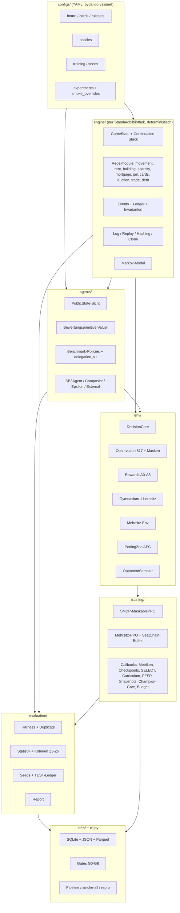
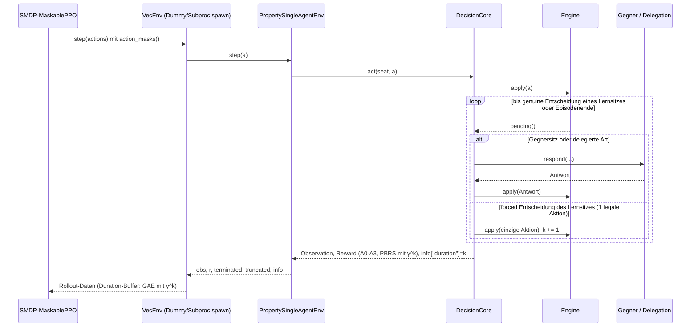

# ARCHITECTURE – Schichten, Datenfluss, Schnittstellen

## 1. Schichten



Abhängigkeiten zeigen nur nach unten: Die Engine importiert nichts außer der Standardbibliothek
(`tests/architecture/test_engine_boundary.py`); Agenten sehen nur `PublicState`; Environments kennen die
Engine-API, nicht ihre Interna; Training und Evaluation verwenden Environments bzw. Engine plus Policies.

## 2. Engine

- **Zustand:** `GameState` mit flachen Slots (Listen fester Länge), `copy()` in O(Größe), kanonisches
  Dict und SHA-256-Hash (`state_hash`, unabhängig vom Event-Logging).
- **State-Machine:** Ein Continuation-Stack aus Int-Tupeln (`engine/frames.py`): automatische Opcodes
  (Zugbeginn, Würfeln, Bewegung, Feldwirkung, Zahlung, Kartenwirkung, Zugende …) werden in `Engine._run`
  abgearbeitet, bis ein Entscheidungs-Frame (Fenster, Handelsangebot/-antwort, Kauf, Auktion, Schulden,
  Platzierung) oben liegt. `pending()` liefert die offene `Decision` (Sitz, Art, Phase, legale Aktionen,
  Kontext), `apply(response)` prüft und wendet an.
- **RNG:** zählerbasiertes splitmix64 `u64(*ints)`; Würfel aus `(seed, DICE, epoch, seat, seat_turn_counter,
  throw, die)`, Decks per Fisher-Yates; `clone(reseed)` mischt nur nicht gezogene Karten neu. Dadurch sind
  Spiele plattform- und reihenfolgeunabhängig reproduzierbar.
- **Buchhaltung:** Jede Geldbewegung läuft über `transfer` mit Ledger-Eintrag; Invarianten (Geldsumme,
  Gebäudebestand, Eigentum, Hypotheken, Phasenkonsistenz) nach jedem `apply`, wenn aktiviert.
- **Log/Replay:** JSONL mit Header (Versionen, Ruleset, Brett, Decks, Optionen, finaler Hash, optional
  Startzustand für Szenarien) und Entscheidungszeilen (optional Zwischen-Hashes); `replay_log` prüft Hashes
  und wirft `ReplayMismatchError`.

## 3. Datenfluss eines Trainingsschritts



## 4. Decision Core und Adapter

`DecisionCore` (`env/core.py`) ist die gemeinsame Basis aller Environments:

- führt Gegner- und delegierte Entscheidungen automatisch aus (Delegation `delegation_v1` für
  TRADE_OFFER, TRADE_RESPONSE, AUCTION_BID, DEBT; N4 zusätzlich MAIN_BUY),
- überspringt forced Entscheidungen der Lernsitze (Auto-Skip, nach Anti-Oszillationsfilter, A-115) und
  zählt die Dauer k je Makroschritt,
- verwaltet je Lernsitz eine offene Transition (Φ beim Start, k, Zusatzreward) und schließt sie bei der
  nächsten genuinen Entscheidung oder am Episodenende (`Closed`),
- prüft den Safety-Horizon und schneidet alle offenen Transitionen mit `terminal_observation` ab,
- berechnet Rewards: A0 terminal, A1 PBRS `r = R + γ^k Φ' − Φ`, A2 gewichtetes Niveau (β2), A3 PBRS plus
  Kingmaking-Malus (4P).

Adapter:

| Klasse | Lernsitze | Schnittstelle |
|---|---|---|
| `PropertySingleAgentEnv` | 1 | Gymnasium `Env`, `action_masks()`, SB3-kompatibel |
| `PropertyMultiSeatEnv` | mehrere (Shared Policy) | Gymnasium-Schritt je Entscheidung, Reward 0, abgeschlossene Transitionen in `info["closed"]`, Sitz in `info["seat"]` |
| `PropertyAECEnv` | alle | PettingZoo AEC (`api_test`) |

Masken liegen als Methode auf der Env-Klasse; `MaskedDiscrete(106)` sampelt nur legale Aktionen und ist
picklebar (`__getstate__`), damit `SubprocVecEnv` mit `spawn` (Windows) funktioniert. Factories
(`make_env`, `env_fns`, `make_vec_env`) sind Top-Level-Funktionen.

## 5. Mehrsitz-Kollektor (§7.2)

```mermaid
flowchart LR
    A[Schritt in Env i, Sitz s] --> B[Zeile im SeatChainRolloutBuffer]
    B --> C{info closed?}
    C -->|Transition von Sitz s geschlossen| D[Reward + Dauer k in die Zeile der Startentscheidung schreiben]
    D --> E[next_row = nächste Zeile desselben Sitzes oder LAST/NO_NEXT]
    E --> F[GAE je Sitzkette: delta = r + γ^k V(next) − V]
    F --> G[Minibatches nur aus valid-Zeilen]
```

- Jede Zeile gehört zu (Env, Sitz). Die Kette eines Sitzes verbindet seine Entscheidungen über
  `next_row`; `LAST = −2` markiert das Ende einer Episode (Bootstrap 0 bzw. Wert der
  `terminal_observation` bei Truncation), `NO_NEXT = −1` eine noch offene Transition am Rolloutende (Zeile
  ungültig, wird in den nächsten Rollout übernommen – „tail merge“).
- Nur `valid`-Zeilen gehen in die Verlustfunktion; explained_variance wird nur über gültige Zeilen
  berechnet.
- Äquivalenztest: Mit genau einem Lernsitz liefert der Mehrsitz-Kollektor dieselben Daten wie die
  Einzelsitz-Umgebung (`tests/env/test_multiseat.py`).

## 6. Gegner, Curriculum, Self-Play

`OpponentSampler` (`env/opponents.py`) plant je Episode die Sitzbelegung: Curriculum-Stufe
(`random_legal` → `roi_markov_v1` → `strong_a_v1`/`strong_b_v1`), Self-Play-Mischung (50 % jüngste
5 Snapshots, 30 % ältere Snapshots mit PFSP-Gewicht (1 − p)², 20 % Baselines `strong_a_v1`/`strong_b_v1`),
4P mit zusätzlichen Lernsitzen (je anderem Sitz 40 %), 4P-Fallback mit „latest“ in der 40-%-Kategorie. Callbacks aktualisieren Stufe, PFSP-Gewichte, Snapshots und latest per `env_method`.

## 7. Evaluation und Infrastruktur

- Harness: `GameSpec` → `play_game` (Engine + Policies, ohne Gym) → Datensatz; parallel über
  `multiprocessing` (spawn-sicher). Duplicate-Spezifikationen (2P beide Sitze, 4P vier Rotationen).
- Speicherung: `artifacts/propertyrl.db` (Tabellen `runs`, `checkpoints`, `eval_summaries`, `test_ledger`,
  `benchmarks`, `gates`), JSON-Dateien je Lauf (`runs/<run_id>/run.json`, `training_state.json`),
  Parquet je Auswertung, eingefrorene Entscheidungen in `artifacts/frozen/`. Alle Ergebnisdateien (nicht die
  Logs) werden atomar und dauerhaft geschrieben (`storage.atomic_path`: Temporärdatei, `fsync`, `os.replace`); was zusammen
  gilt, steht in einer SQLite-Transaktion (TEST-Auswertung und Ledger-Zeile, A-139). `propertyrl doctor`
  prüft den Zustand nach einem Abbruch (A-142).
- `PROPERTYRL_HOME` verlegt `artifacts/`, `runs/`, `reports/` (Tests nutzen ein temporäres Verzeichnis).
- Gates G0–G8 werden ausschließlich aus Artefakten bewertet (Testreports, Coverage, Fuzz-/Markov-Berichte,
  Benchmark, eingefrorene Dateien, Auswertungen, Repro-Dateien).

## 8. Fehlerklassen

`PropertyRLError` (Basis, trägt `game_seed`, `decision_index`, `seat`, optional Spiel-Log) mit
`IllegalActionError`, `RuleViolationError`, `InvariantError`, `EngineWatchdogError`, `ReplayMismatchError`,
`SchemaVersionError`, `ConfigError`, `SeedLedgerError`, `ArtifactError` (unlesbare oder unvollständige
Datei, mit Reparaturbefehl). Fehler in Evaluation und Fuzzing schreiben das Spiel-Log nach
`artifacts/errors/` (`dump_error_log`).
