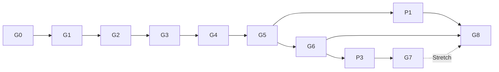

# ROADMAP – Gates, Wochenplan und Fallbacks (§12)

Dieser Build erfüllt G0–G2 vollständig (CI-Varianten selbst ausgeführt) und liefert G3–G8 als lauffähige
Pipeline mit Smoke-Nachweis (`propertyrl pipeline --smoke-all`); die vollen Läufe startet der Nutzer
(Befehle: `docs/TRAINING_GUIDE.md`, Gate-Status: `propertyrl gates`).

Planungsannahmen: 26 Wochen ab Projektstart, 1 Person, 15–20 h pro Woche, rund 22 Arbeitswochen plus 4
Pufferwochen.

## Wochenplan

| Woche | Gate / Paket | Kriterien | Fallback |
|---|---|---|---|
| W1 | **G0** | Artefaktsatz RULESPEC v0, Action Schema v0, Heuristik-Spezifikation v0, Testmatrix, Benchmark-Protokoll liegt vor; Nutzer hat V1–V6 geprüft (`propertyrl gates --confirm-v-points`) | Standardwerte einfrieren |
| W1–5 | **G1** (W5) | jede Regel-ID getestet; 10 Mio. Fuzz-Entscheidungen ohne Invariantenverletzung; Markov 10 Mio. innerhalb 0,05 pp; alle Mutanten fallen; archivierte Replays identisch; Coverage-Schwellen; Event-Coverage | Mehrfach-Asset-Angebote per Ruleset-Flag auf ein Asset je Seite begrenzen, volle Prüfung bis W10 nachholen; steht G1 bis W7 nicht: Engine-Umfang reduzieren (zusätzlich `scarcity_auction: false`, dann gilt K-05), kein RL vorziehen |
| W5–7 | **G2** (W7) | check_env (Gymnasium und SB3), api_test, 0 illegale Aktionen in 1 Mio. maskierten Schritten, Durchsatz mit und ohne Logging gemessen, SubprocVecEnv-Test grün, Mehrsitz-Äquivalenztest grün | Logging im Training aus, Profiling vor G3 |
| W7–9 | **G3** (W9) | Round-Robin transitiv und stabil über beide SELECT-Blöcke, stärkste Baseline eingefroren, Horizont kalibriert mit Truncation-Quote < 5 % | `strong_b_v1` streichen, `strong_a_v1` als einzige Referenz |
| W9–12 | **G4** (W12) | erster Agent: gegen `random_legal` ≥ 90 %, gegen `roi_markov_v1` > 50 % auf SELECT; γ eingefroren | Diagnose-Checkliste (`propertyrl diagnose`) |
| W12–14 | **G5** (W14, MCR) | Z3 auf TEST | Diagnose, dann mehr Delegation (Ablation N4 als neuer Hauptpfad), dann `fallback_research_2p`; bis W16 sonst Negativergebnis dokumentieren |
| W15 | Puffer 1 | – | – |
| W16–17 | **P1** | Reward- und Aktionsraum-Ablationen (A0, A2, N4, ohne Handel, gemeinsame Delegation, ohne SMDP, Kurzspiel-Vergleich) mit 3 Seeds; Rechenzeit parallel zur Self-Play-Arbeit | – |
| W17–19 | **G6** (W19), P2 | Snapshot-Self-Play, Z4 | MCR-Agent bleibt Champion, Zyklen analysieren, 4P wird Puffer |
| W20 | Puffer 2 | – | – |
| W21–22 | **P3** | 4P-Prototyp mit Mehrsitz-Training | – |
| W23 | **G7** (W23, Stretch), P4 | 4P-Evaluation, Z5 | `fourp_single_seat_fallback`; reicht auch das nicht, 4P als Ausblick dokumentieren |
| W24–25 | Puffer 3 und 4 | bei Nichtbedarf: Abschlussbericht vorziehen, A0, A1 und A2 auf 5 Seeds erweitern (`--extended`) | – |
| W26 | **G8**, P5 | TEST-Bericht, Ablationen, Repro-Paket mit einem Befehl (`propertyrl repro`) | Ablationen auf A0 und A1 begrenzen |

## Abhängigkeiten

## Gate-Bewertung im Code

`propertyrl gates` (`src/propertyrl/infra/gates.py`) liest ausschließlich Artefakte:

| Gate | Quelle |
|---|---|
| G0 | Dokumente in `docs/`, `artifacts/frozen/v_points_confirmed.json` |
| G1 | `artifacts/test-reports/junit.xml` (Regel-ID-, Golden-, Hypothesis-, Mutanten-, Replay-, Event-Coverage-Tests), `coverage.xml`, `artifacts/fuzz/fuzz_report.json`, `artifacts/markov/markov_report.json` |
| G2 | Testreport (Env-Tests), `artifacts/benchmarks/benchmark_*.json` |
| G3 | `artifacts/frozen/strongest_baseline.json`, `horizon.json` |
| G4 | SELECT-Auswertungen von `mcr_official_2p`, `artifacts/frozen/gamma.json` |
| G5 | Z3 aus TEST-Auswertungen von `mcr_official_2p` |
| G6 | Z4 aus TEST-Auswertungen von `selfplay_official_2p` |
| G7 | Z5 aus TEST-Auswertungen von `fourp_official` oder `fourp_single_seat_fallback` |
| G8 | `artifacts/repro/repro_*.json`, `reports/mcr_official_2p.md`, TEST-Auswertungen von A0 und A1 |

Status je Kriterium: `PASS`, `FAIL` oder „bereit, nicht ausgeführt“ (mit Smoke-Nachweis, falls vorhanden).
G1 und G2 werden zusätzlich als „CI-Größe“ markiert, solange die Gate-Größen (10 Mio. Fuzz, 10 Mio. Markov
mit 0,05 pp, 1 Mio. Maskenschritte) nicht ausgeführt wurden.
